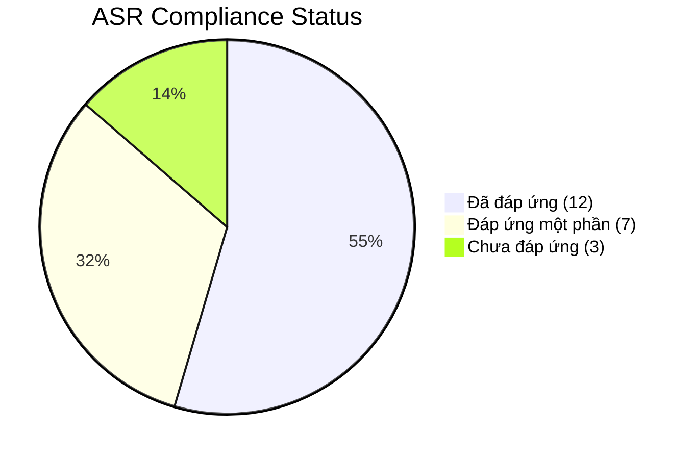

# Phân Tích Gap: Codebase vs. ASR Requirements (Cập nhật 2026-05-17)

> [!NOTE]
> Phân tích này được thực hiện sau khi đã triển khai các thay đổi cho ASR-S1, ASR-P2, ASR-P3, ASR-SEC5, ASR-R1/R2, ASR-R3, ASR-M3, và ASR-D1.

---

## Tổng quan nhanh

| Trạng thái | Số lượng | ASR IDs |
|------------|---------|---------|
| ✅ Đã đáp ứng | 12 | S1, S2, S3, P1, P2, P3, SEC1, SEC3, SEC5, M1, M2, D2 |
| 🟡 Đáp ứng một phần | 7 | A1, R1, R2, R3, M3, D1, O1 |
| ❌ Chưa đáp ứng | 3 | A2, SEC2, SEC4 |
| ⚪ Chưa triển khai (Ops) | 2 | O2, I1/I2/I3 |

---

## 1. Availability ASRs

### ASR-A1 — High Availability 99.99% 🟡 Đáp ứng một phần

| Yêu cầu | Trạng thái | Evidence |
|----------|-----------|----------|
| Multi-instance deployment | ✅ | Redis Pub/Sub Event Bus cho phép chạy nhiều instance ([eventBus.ts](file:///home/nguyenhongquan/study/store_chain/backend/src/lib/events/eventBus.ts)) |
| Load balancing | 🟡 | Terraform ECS Cluster đã sẵn sàng, nhưng chưa có ALB config cụ thể |
| Failover database | ✅ | Aurora PostgreSQL Multi-AZ trong [main.tf](file:///home/nguyenhongquan/study/store_chain/infrastructure/terraform/main.tf) |
| Distributed cache | ✅ | Redis Cluster support ([redis.ts](file:///home/nguyenhongquan/study/store_chain/backend/src/lib/cache/redis.ts)) |
| Health checks | ✅ | Endpoint `/health` đã có |
| Zero SPOF | 🟡 | DB + Cache đã HA; còn thiếu API Gateway redundancy |

**Gap còn lại:** Cần bổ sung ALB/API Gateway config trong Terraform và Kubernetes/ECS Service definition cho auto-scaling.

---

### ASR-A2 — POS Offline-first ❌ Chưa đáp ứng

| Yêu cầu | Trạng thái | Evidence |
|----------|-----------|----------|
| Offline-first POS | ❌ | Frontend POS chưa có local DB (IndexedDB/SQLite) |
| Local transaction queue | ❌ | Chưa có outbox pattern ở client |
| Eventual consistency | 🟡 | Event Bus đã hỗ trợ async sync, nhưng thiếu reconciliation |
| Retry/reconciliation | ❌ | Chưa có sync service |

**Gap còn lại:** Đây là thay đổi chủ yếu ở **Frontend POS** — cần xây dựng offline storage, transaction queue, và sync reconciliation service.

---

## 2. Scalability ASRs

### ASR-S1 — Support 100+ Stores ✅ Đã đáp ứng

| Yêu cầu | Trạng thái | Evidence |
|----------|-----------|----------|
| Horizontal scalability | ✅ | Event Bus dùng Redis Pub/Sub, multi-instance ready |
| Multi-tenant partitioning | ✅ | Dữ liệu phân tách theo `store_id` ở mọi bảng |
| Distributed cache | ✅ | Redis Cluster support |
| Read replicas | ✅ | `getReadPrisma()` hỗ trợ read replicas |

---

### ASR-S2 — Real-time Inventory Sync ✅ Đã đáp ứng

| Yêu cầu | Trạng thái | Evidence |
|----------|-----------|----------|
| Event-driven architecture | ✅ | Event Bus + inventory publisher |
| WebSocket push | ✅ | Socket.IO broadcasting ([socket.ts](file:///home/nguyenhongquan/study/store_chain/backend/src/events/socket.ts)) |
| Concurrency handling | ✅ | Optimistic Locking với cột `version` |

---

### ASR-S3 — Dynamic Pricing Engine ✅ Đã đáp ứng

| Yêu cầu | Trạng thái | Evidence |
|----------|-----------|----------|
| Batch processing | ✅ | Cron job 15 phút + Bull.js queue |
| Rule engine | ✅ | `pricing_rules` model + `pricingEngine.ts` |
| Rule caching | ✅ | In-memory L1 cache + Redis L2 |

---

## 3. Performance ASRs

### ASR-P1 — Dynamic Price Lookup <100ms ✅ Đã đáp ứng

| Yêu cầu | Trạng thái | Evidence |
|----------|-----------|----------|
| Aggressive caching | ✅ | L1 In-memory (<1ms) → L2 Redis (~5ms) → L3 DB |
| Precomputed pricing | ✅ | `pricingEngine.warmupEngineCache()` |
| CQRS read optimization | ✅ | Read replicas + cached pricing responses |

---

### ASR-P2 — Real-time Dashboard Analytics ✅ Đã đáp ứng

| Yêu cầu | Trạng thái | Evidence |
|----------|-----------|----------|
| Streaming analytics | ✅ | [analyticsAggregator.ts](file:///home/nguyenhongquan/study/store_chain/backend/src/modules/reports/analyticsAggregator.ts) lắng nghe `checkout.completed` |
| Data aggregation pipeline | ✅ | Redis Hashes/Sorted Sets cho realtime metrics |
| CQRS | ✅ | Write → DB + Event → Read ← Redis projections |
| Read optimization | ✅ | `reports.service.ts` đọc từ Redis CQRS read model |

---

### ASR-P3 — POS Transactions Low Latency ✅ Đã đáp ứng

| Yêu cầu | Trạng thái | Evidence |
|----------|-----------|----------|
| Saga pattern | ✅ | [checkoutSaga.ts](file:///home/nguyenhongquan/study/store_chain/backend/src/lib/saga/checkoutSaga.ts) với compensating transactions |
| Async events | ✅ | `checkout.completed` / `checkout.failed` events |
| Cached promotion rules | ✅ | `promotionRules.ts` với warmup cache |

---

## 4. Security ASRs

### ASR-SEC1 — RBAC ✅ Đã đáp ứng

| Yêu cầu | Trạng thái | Evidence |
|----------|-----------|----------|
| Authorization middleware | ✅ | `rbac.middleware.ts` |
| JWT authentication | ✅ | `auth.middleware.ts` |
| Fine-grained permissions | ✅ | `roles` table + `user_stores` multi-store assignment |

---

### ASR-SEC2 — Secure Authentication (SSO) ❌ Chưa đáp ứng

| Yêu cầu | Trạng thái | Evidence |
|----------|-----------|----------|
| JWT auth | ✅ | Đã có `jsonwebtoken` |
| OAuth2/OpenID Connect | ❌ | Chưa tích hợp Keycloak/Auth0 |
| SSO support | ❌ | Chưa có |

**Gap còn lại:** Cần tích hợp Identity Provider (Keycloak/Auth0) cho SSO enterprise.

---

### ASR-SEC3 — Auditability ✅ Đã đáp ứng

| Yêu cầu | Trạng thái | Evidence |
|----------|-----------|----------|
| Immutable audit logging | ✅ | `audit_logs` table + audit service |
| Pricing audit | ✅ | `pricing_history` table (8 references in schema) |
| Centralized logging | ✅ | ELK stack integration (ASR-M3) |

---

### ASR-SEC4 — WAF and DDoS Protection ❌ Chưa đáp ứng

| Yêu cầu | Trạng thái | Evidence |
|----------|-----------|----------|
| Rate limiting | ✅ | `express-rate-limit` trong `app.ts` |
| Security headers | ✅ | `helmet` trong `app.ts` |
| WAF/DDoS protection | ❌ | Chưa có Cloudflare/AWS Shield config |
| CDN edge filtering | ❌ | Chưa có |

**Gap còn lại:** Cần setup WAF (AWS WAF/Cloudflare) ở tầng infrastructure. Đây là config cloud, không phải code.

---

### ASR-SEC5 — Loyalty Data Privacy ✅ Đã đáp ứng

| Yêu cầu | Trạng thái | Evidence |
|----------|-----------|----------|
| PII encryption | ✅ | AES-256-CBC deterministic encryption ([privacy.ts](file:///home/nguyenhongquan/study/store_chain/backend/src/utils/privacy.ts)) |
| Data masking | ✅ | `maskEmail()`, `maskPhone()`, `maskName()` |
| Secret management | 🟡 | Dùng env var `PII_ENCRYPTION_KEY`, chưa có Vault/KMS |

---

## 5. Reliability ASRs

### ASR-R1 — Automatic Database Failover 🟡 Đáp ứng một phần

| Yêu cầu | Trạng thái | Evidence |
|----------|-----------|----------|
| HA database topology | ✅ | Aurora Multi-AZ trong Terraform |
| Replication monitoring | 🟡 | Terraform provisioned, chưa có CloudWatch alarms |

**Gap còn lại:** Cần thêm CloudWatch/PagerDuty alerting cho DB failover events.

---

### ASR-R2 — Disaster Recovery 🟡 Đáp ứng một phần

| Yêu cầu | Trạng thái | Evidence |
|----------|-----------|----------|
| Automated backups | ✅ | Aurora 14-day retention + cron backup job |
| Cross-region replication | ✅ | Aurora cross-region replica (Tokyo) trong [main.tf](file:///home/nguyenhongquan/study/store_chain/infrastructure/terraform/main.tf) |
| Terraform IaC | ✅ | `infrastructure/terraform/` |
| DR runbook | ❌ | Chưa có tài liệu DR procedure |

**Gap còn lại:** Cần viết DR runbook và test DR failover procedure.

---

### ASR-R3 — Inventory Consistency 🟡 Đáp ứng một phần

| Yêu cầu | Trạng thái | Evidence |
|----------|-----------|----------|
| Optimistic locking | ✅ | Cột `version` trong `inventories` + WHERE version check |
| Event versioning | 🟡 | Events chưa có sequence number/version field |
| Idempotent processing | 🟡 | Chưa có deduplication key cho event handlers |

**Gap còn lại:** Cần thêm event sequence numbering và idempotency key cho consumer handlers.

---

## 6. Maintainability ASRs

### ASR-M1 — Modular Architecture ✅ Đã đáp ứng

| Yêu cầu | Trạng thái | Evidence |
|----------|-----------|----------|
| Bounded contexts | ✅ | 23 module directories (POS, Loyalty, Pricing, Inventory, etc.) |
| Loose coupling | ✅ | Event-driven communication giữa modules |
| Clean architecture | ✅ | Router → Service → DB pattern nhất quán |

---

### ASR-M2 — Extensible Pricing Rule Engine ✅ Đã đáp ứng

| Yêu cầu | Trạng thái | Evidence |
|----------|-----------|----------|
| Rule types | ✅ | `demand_based`, `competitor_based`, `time_based`, `fixed`, `percentage` |
| Strategy pattern | ✅ | `pricing_rules.rule_type` với dynamic evaluation |
| Competitor data | ✅ | `competitor_prices` table + `demand_metrics` |

---

### ASR-M3 — Observability & Distributed Tracing 🟡 Đáp ứng một phần

| Yêu cầu | Trạng thái | Evidence |
|----------|-----------|----------|
| OpenTelemetry | ✅ | [tracing.ts](file:///home/nguyenhongquan/study/store_chain/backend/src/lib/monitoring/tracing.ts) với NodeSDK + auto-instrumentations |
| Jaeger | ✅ | OTLP exporter → Jaeger trong [docker-compose.observability.yml](file:///home/nguyenhongquan/study/store_chain/docker-compose.observability.yml) |
| ELK stack | ✅ | Elasticsearch + Kibana + Logstash + pino-elasticsearch transport |
| Trace-log correlation | ✅ | `traceId`/`spanId` injected vào mọi log line |
| Grafana dashboards | ❌ | Prometheus đã có, nhưng chưa có Grafana config/dashboards |

**Gap còn lại:** Cần bổ sung Grafana service và pre-built dashboards cho metrics visualization.

---

## 7. Integration ASRs

### ASR-I1 — Real-time POS Sync ✅ Đã đáp ứng

| Yêu cầu | Trạng thái | Evidence |
|----------|-----------|----------|
| WebSocket | ✅ | Socket.IO server + handlers |
| Pub/Sub | ✅ | Redis Pub/Sub Event Bus |

---

### ASR-I2 — Competitor Pricing Feed ✅ Đã đáp ứng (Data Model)

| Yêu cầu | Trạng thái | Evidence |
|----------|-----------|----------|
| Data model | ✅ | `competitor_prices` table |
| Integration service | 🟡 | Schema ready, nhưng chưa có scraper/ETL worker thực tế |

---

### ASR-I3 — Supplier API ✅ Đã đáp ứng (Partial)

| Yêu cầu | Trạng thái | Evidence |
|----------|-----------|----------|
| API versioning | ✅ | `/api/v1/` prefix |
| OpenAPI/Swagger | ✅ | Swagger UI tại `/api-docs` |
| Public API Gateway | ❌ | Chưa có dedicated API Gateway (Kong/AWS API GW) |

---

## 8. Data Management ASRs

### ASR-D1 — High-volume Transaction Storage 🟡 Đáp ứng một phần

| Yêu cầu | Trạng thái | Evidence |
|----------|-----------|----------|
| Partitioned tables | ✅ | [migration.sql](file:///home/nguyenhongquan/study/store_chain/backend/prisma/migrations/20260517_asr_d1_table_partitioning/migration.sql) — 4 bảng RANGE partitioned |
| Auto-partition maintenance | ✅ | Cron job tự tạo partition hàng tháng |
| Read replicas | ✅ | `getReadPrisma()` |
| Data archival | 🟡 | Có thể DROP partition cũ, nhưng chưa có automated archival policy |

**Gap còn lại:** Cần thêm automated archival cron job và cold storage strategy.

---

### ASR-D2 — Immutable Price History ✅ Đã đáp ứng

| Yêu cầu | Trạng thái | Evidence |
|----------|-----------|----------|
| Append-only history | ✅ | `pricing_history` table (append-only, no UPDATE) |
| Versioned data | ✅ | `old_price`, `new_price`, `price_change_percent` tracked |
| Audit trail | ✅ | `reason`, `triggered_by` fields |

---

## 9. Deployment & Operations ASRs

### ASR-O1 — Centralized Monitoring 🟡 Đáp ứng một phần

| Yêu cầu | Trạng thái | Evidence |
|----------|-----------|----------|
| Prometheus metrics | ✅ | `prom-client` + `/metrics` endpoint |
| Centralized logging | ✅ | ELK stack |
| Alerting | ❌ | Chưa có Alertmanager/PagerDuty integration |
| Grafana dashboards | ❌ | Chưa có |

---

### ASR-O2 — Automated Deployment ⚪ Chưa triển khai

| Yêu cầu | Trạng thái | Evidence |
|----------|-----------|----------|
| CI/CD | ❌ | `ci.yml.disabled` — pipeline đã viết nhưng disabled |
| Blue-green deploy | ❌ | Chưa có |
| GitOps | ❌ | Chưa có ArgoCD/Flux |
| IaC | ✅ | Terraform đã có |

**Gap còn lại:** Cần enable CI/CD pipeline và setup blue-green deployment strategy.

---

## Biểu đồ tổng quan

## Top 5 Gaps Ưu Tiên Cao Nhất

| # | ASR | Gap | Effort | Impact |
|---|-----|-----|--------|--------|
| 1 | **ASR-A2** | Offline-first POS (IndexedDB + sync service) | 🔴 Lớn | 🔴 Rất cao |
| 2 | **ASR-O2** | Enable CI/CD + Blue-green deployment | 🟡 Trung bình | 🔴 Cao |
| 3 | **ASR-SEC2** | SSO / Identity Provider integration | 🟡 Trung bình | 🟡 Trung bình |
| 4 | **ASR-SEC4** | WAF / DDoS protection (cloud config) | 🟢 Nhỏ | 🟡 Trung bình |
| 5 | **ASR-O1** | Grafana dashboards + Alerting | 🟢 Nhỏ | 🟡 Trung bình |
