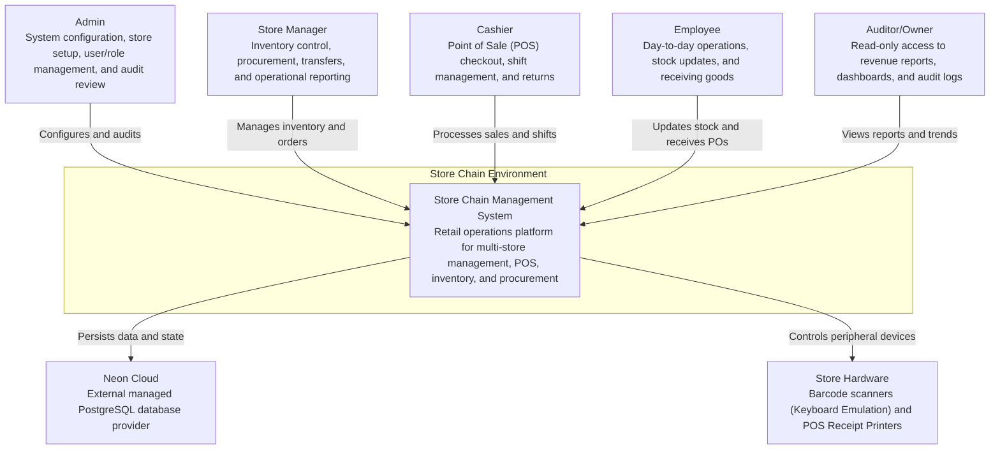

```mermaid
graph TB

%% 1. External Actors (Top of diagram)
Person["Admin<br/>System configuration, store setup, user/role management, and audit review"]
Manager["Store Manager<br/>Inventory control, procurement, transfers, and operational reporting"]
Cashier["Cashier<br/>Point of Sale (POS) checkout, shift management, and returns"]
Staff["Employee<br/>Day-to-day operations, stock updates, and receiving goods"]
Auditor["Auditor/Owner<br/>Read-only access to revenue reports, dashboards, and audit logs"]

%% 2. Main System Boundary
subgraph StoreChainEnvironment["Store Chain Environment"]
  StoreSystem["Store Chain Management System<br/>Retail operations platform for multi-store management, POS, inventory, and procurement"]
end

%% 3. External Systems / Infrastructure (Bottom)
Neon["Neon Cloud<br/>External managed PostgreSQL database provider"]
Hardware["Store Hardware<br/>Barcode scanners (Keyboard Emulation) and POS Receipt Printers"]

%% 4. Relationships (Visual order: User -> System -> Dependency)
Person -->|"Configures and audits"| StoreSystem
Manager -->|"Manages inventory and orders"| StoreSystem
Cashier -->|"Processes sales and shifts"| StoreSystem
Staff -->|"Updates stock and receives POs"| StoreSystem
Auditor -->|"Views reports and trends"| StoreSystem

StoreSystem -->|"Persists data and state"| Neon
StoreSystem -->|"Controls peripheral devices"| Hardware
```
